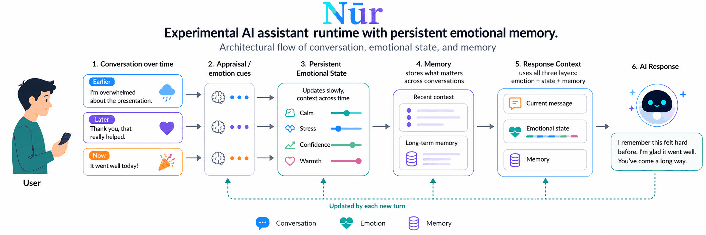

# Project Nūr



> Most AI assistants remember what you said.
>
> **Nūr experiments with remembering what it meant between you.**

**Nūr is an experimental AI assistant runtime with persistent emotional memory.**

It does not give an AI real feelings. It gives an LLM a structured state layer for mood, trust, tension, repair, commitments, and relationship continuity, so the assistant does not have to start emotionally from zero every turn.

A normal assistant can sound warm for one reply. Nūr asks a different question: what if warmth, rupture, apology, hesitation, repair, and unfinished business were part of runtime state — inspectable, persistent, decaying, and testable?

[](https://github.com/balfiky/nur/actions/workflows/ci.yml)
[](LICENSE)
[](pyproject.toml)
[](CHANGELOG.md)

> **Honest scope:** Nūr is a research/product prototype. It does not claim consciousness, sentience, real feelings, therapy, diagnosis, psychological validity, or proven human-likeness.
> Nūr persists relational and semantic memory under `data/`. Use it with consent when other people are involved, and see [PRIVACY.md](PRIVACY.md) for inspection, export, and deletion.

## What That Feels Like

```text
Day 1
You:  You completely misunderstood me.
Nūr:  You're right. I missed what mattered there.
                                  # rupture recorded · trust drops · open loop created

Day 3
You:  I think I was too harsh earlier.
Nūr:  I remember that moment. We don't have to ignore it.
      Want to repair it properly?
                                  # repair detected · loop begins to close

Day 10
You:  This feels easier now.
Nūr:  It does. There was tension here before, and it softened.
                                  # relationship arc persists across sessions
```

The LLM writes language. Deterministic state, memory retrieval, and safety gates live *outside* the model — so the assistant's stance toward you accumulates instead of resetting.

## Why This Is Different

Most assistant memory systems store facts:

- your name
- your preferences
- things you asked before

Nūr stores relational state:

- what felt warm
- what felt unresolved
- what broke trust
- what repaired it
- what commitments remain open
- how the assistant's stance should change after history

The LLM still writes the words. Nūr changes the state those words come from.

## Life History And Evolution

Nūr also has an early **Life History** layer for formative material: pasted
texts, notes, essays, and local text/Markdown files. This is not just a
summarizer. It records an experience, then writes an inspectable evolution
trace: belief shifts, drive changes, self-trait observations, and future
behavior tendencies.

That means the project now has two distinct continuity layers:

- **Relational continuity:** how Nūr remembers people, tension, repair, and
  unfinished business.
- **Identity continuity:** how Nūr records experiences that may change its
  worldview, motivations, and self-model over time.

This layer is intentionally experimental. It is observable in `/admin` →
**Life** and stored under `data/shared/life_history.db`. Runtime sessions now
load a compact slice of current beliefs, shifted drives, and recent evolution
into generation, so formative experiences can bias Nūr's perspective without
dumping raw source material into every prompt.

## Build With It

Use Nūr if you want to experiment with:

- emotionally persistent AI companions
- long-running personal assistants
- relationship-aware agent memory
- formative experience and worldview tracking
- inspectable affective state
- rupture, repair, and commitment tracking
- safer stateful tool use around LLMs

It is alpha, imperfect, and intentionally honest about what it does not prove.

## Quickstart

```bash
pip install project-nur
nur-web
```

Open http://localhost:8000. A first-run wizard walks you through LLM backend,
seed identity, and an optional first formative experience.

To keep your customized agent identity across `pip install --upgrade`:

```bash
export NUR_CONFIG_DIR=~/.config/nur
mkdir -p "$NUR_CONFIG_DIR"
```

### From Source

```bash
git clone https://github.com/balfiky/nur.git
cd nur
python3 -m pip install -e ".[dev]"
nur-web                    # web UI at :8000
nur                        # console runtime
```

## Start Here

| Need | Document |
|---|---|
| Product/concept overview | [docs/OVERVIEW.md](docs/OVERVIEW.md) |
| Runtime architecture | [docs/ARCHITECTURE.md](docs/ARCHITECTURE.md) |
| Install, admin, deployment | [docs/DEPLOYMENT_AND_ADMIN.md](docs/DEPLOYMENT_AND_ADMIN.md) |
| Security model | [SECURITY.md](SECURITY.md) |
| Privacy and data deletion | [PRIVACY.md](PRIVACY.md) |
| Release history | [CHANGELOG.md](CHANGELOG.md) |
| Contributing | [CONTRIBUTING.md](CONTRIBUTING.md) |

## Configure An LLM

The setup wizard or `/admin` console is the preferred path.

| Backend | Use case |
|---|---|
| `mock` | Offline/local testing with deterministic mock responses |
| `provider` | Hosted OpenAI-compatible gateways |
| `openai_compatible` | Local/remote servers (Ollama, LM Studio, vLLM) |
| `minimax` | Legacy MiniMax-specific path |
| `auto` | Compatibility fallback; warns when no LLM is configured |

Runtime config is `runtime_config.yaml` in the current working directory. Identity is `config/soul.yaml`, or `$NUR_CONFIG_DIR/soul.yaml` when the override is set.

## Architecture At A Glance


Two entry points share the same session and cognition layer:

- `nur-web` — FastAPI, bundled chat UI, `/admin`, legacy endpoints, `/v1/*`
- `nur` — console, Telegram, debug runtime

The core turn path runs `SessionManager` → `UserSession` → `CognitivePipeline`. The LLM writes language; deterministic state, memory, safety gates, and retrieval happen around it. See [docs/ARCHITECTURE.md](docs/ARCHITECTURE.md).

## API Quick Tour

```bash
# Health, no auth required
curl http://127.0.0.1:8000/v1/health

# Chat, auth optional unless api_key is configured
curl -X POST http://127.0.0.1:8000/v1/chat \
  -H 'Content-Type: application/json' \
  -d '{"message":"hello","user_id":"demo","chat_id":"main"}'

# With auth enabled
curl -X POST http://127.0.0.1:8000/v1/chat \
  -H 'Authorization: Bearer YOUR_TOKEN' \
  -H 'Content-Type: application/json' \
  -d '{"message":"hello","user_id":"demo","chat_id":"main"}'
```

OpenAPI docs at http://127.0.0.1:8000/docs when the server is running.

## Production Posture

Before exposing Nūr beyond localhost:

- Set `api_key` so admin and chat endpoints require bearer auth
- Keep `tools_enabled: false` and `shell_tool_enabled: false` unless explicitly needed
- Set Telegram allowlists before enabling a bot
- Treat `data/`, `runtime_config.yaml`, and backups as sensitive
- Read [docs/DEPLOYMENT_AND_ADMIN.md](docs/DEPLOYMENT_AND_ADMIN.md), [SECURITY.md](SECURITY.md), and [PRIVACY.md](PRIVACY.md)

## Common Commands

```bash
python3 -m pytest                                # full suite
python3 -m pytest tests/test_interface.py -q     # focused interface tests
python3 -m evals --backend mock --tag phase11    # offline behavioral eval pack
python3 -m build --sdist --wheel                 # build wheel and sdist
```

## Repository Layout

```text
config/     YAML config and prompt templates
core/       Cognitive state, appraisal, memory, profiles, dual process
runtime/    Runtime config, channels, session lifecycle, tool factory
interface/  FastAPI app, /v1 API, client, bundled web UI
evals/      Behavioral scenario and ablation harness
tests/      Unit, integration, regression, runtime, and API tests
docs/       Public docs, design docs, diagrams, research notes
```

## Current Status

Version `0.26.2`. Reproducible eval evidence is intentionally narrow: relationship memory is load-bearing under the current Phase 11 scenarios. The Life History layer records formative experiences and observable self-change, but does not yet prove an independent or human-like character. The project does not claim human-likeness, therapeutic value, consciousness, or psychological validity.
