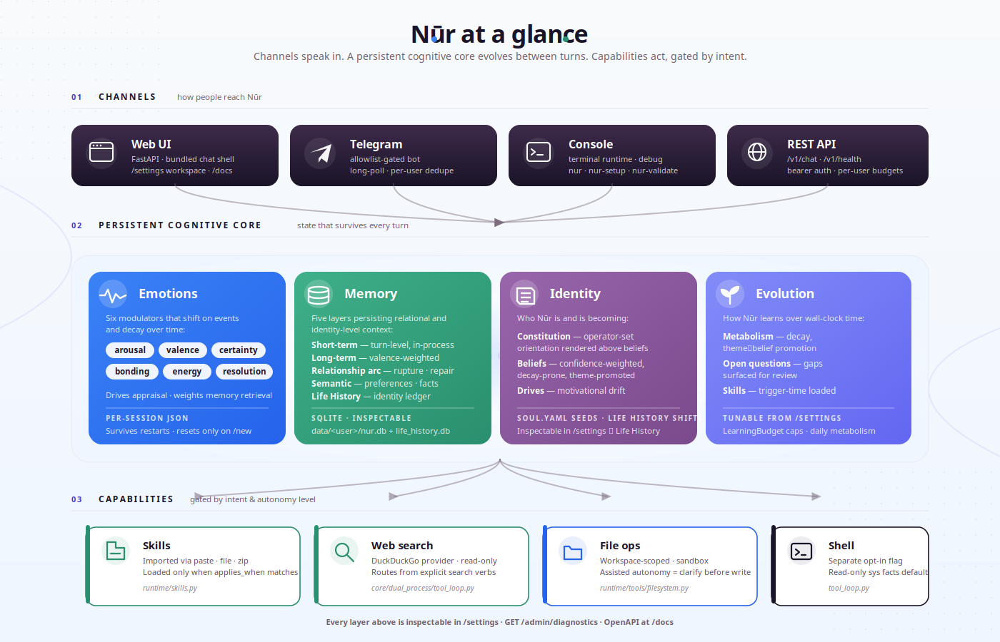

<p align="center">
  <picture>
    <source media="(prefers-color-scheme: dark)" srcset="docs/diagrams/wordmark-dark.svg">
    
  </picture>
</p>

<p align="center">
  <strong>Persistent state, evolving identity, accumulated learning — for any LLM.</strong>
</p>

<p align="center">
  <a href="https://github.com/balfiky/nur/actions/workflows/ci.yml"></a>
  <a href="LICENSE"></a>
  <a href="pyproject.toml"></a>
  <a href="CHANGELOG.md"></a>
</p>

<p align="center">
  <a href="docs/UAT.md"></a>
  <a href="docs/ARCHITECTURE.md"></a>
  <a href="docs/OVERVIEW.md"></a>
  <a href="#configure-an-llm"></a>
</p>

Most LLM agents reset to zero every turn. **Nūr keeps the room lit.**

Memory, beliefs, drives, mood, learned skills, and the long arc of a relationship live as runtime state — inspectable, persistent, decaying, testable. The LLM still writes the words. Nūr changes the state those words come from.

In the agent-memory reference class (MemGPT, Letta, mem0, LangGraph state), Nūr is the one that also tracks **identity continuity** (constitution, beliefs, drives, self-traits) and **relational continuity** (rupture, repair, open commitments) alongside conventional memory.

[Quickstart](#quickstart) · [Overview](docs/OVERVIEW.md) · [Architecture](docs/ARCHITECTURE.md) · [Admin & Deploy](docs/DEPLOYMENT_AND_ADMIN.md) · [Privacy](PRIVACY.md) · [Changelog](CHANGELOG.md)

---

<p align="center">
  
</p>

> **Honest scope.** Nūr is an experimental runtime — not a therapist, not an AGI claim, not a consciousness claim. It is engineered scaffolding that holds *the state behind* an LLM's words across turns, sessions, and time. Memory and identity state live under `data/` — use it with consent when other people are involved. See [PRIVACY.md](PRIVACY.md) for inspection, export, and deletion.

## What State Looks Like Across Turns

Same runtime, two different continuity arcs:

```text
─── Relational arc (relationship memory + arc tracking) ───
Day 1
You:  You completely misunderstood me.
Nūr:  You're right. I missed what mattered there.
                                  # rupture recorded · trust drops · open loop created

Day 3
You:  I think I was too harsh earlier.
Nūr:  I remember that moment. We don't have to ignore it.
                                  # repair detected · loop begins to close

Day 10
You:  This feels easier now.
Nūr:  It does. There was tension here before, and it softened.
                                  # relationship arc persists across sessions

─── Identity arc (life-history ingest + belief revision + drive drift) ───
Mon
You:  Learn from this paper: <url>
Nūr:  Recorded. Three beliefs shifted, one drive intensified.
                                  # life-history event written · evolution trace emitted

Wed (no further input)
                                  # metabolism tick: weak beliefs decayed
                                  #                  recurring theme promoted to belief
                                  #                  drive-gap question opened

Fri
You:  Why did you push back on that?
Nūr:  A belief I formed Monday is shaping how I read this. Want to see it?
                                  # constitution + current beliefs surfaced for "why"
```

The LLM writes language. Deterministic state — memory retrieval, belief revision, decay, safety gates — lives *outside* the model. The assistant's stance accumulates instead of resetting.

## Runtime Layers

| Layer | What it does | Where it lives |
|---|---|---|
| **Short-term memory** | Hot turn-level memory inside the running session | in-process |
| **Long-term memory** | Distilled summaries with valence + spike flags; retrieval is valence-weighted | `data/<user>/nur.db` |
| **Relationship arc** | Rupture, repair, recurring tension, commitments, open loops; cross-session | `data/<user>/nur.db` |
| **Semantic memory** | Preferences, decisions, facts; topic-scoped retrieval | `data/<user>/nur.db` |
| **Life History** | Identity-level experience ledger; beliefs, drives, evolution events, themes | `data/shared/life_history.db` |
| **Constitution** | Operator-set stable orientation rendered above evolving beliefs every prompt | `data/shared/life_history.db` |
| **Self-evolution** | Wall-clock metabolism: belief decay, theme→belief promotion, drive-gap detection | `runtime/life_history.py` |
| **Open questions** | Reflection-emitted queue (contradiction / low-confidence / drive-gap) with operator lifecycle | `data/shared/life_history.db` |
| **Ask-user surfacing** | Drive-gated mid-conversation question with daily budget (LearningBudget) | `runtime/learning/surface.py` |
| **Trigger-time skills** | `applies_when`-filtered skill loading by chat hint | `runtime/skills.py` |
| **Modulators** | Six-dim affective state (arousal, valence, certainty, bonding, energy, resolution); decay over time, shift on events | `core/emotion`, session state file |
| **Tool gates** | Read-only by default; assisted autonomy needs confirmation; shell is a separate opt-in | `core/dual_process/tool_loop.py` |

Every layer above is inspectable through `/settings#observability` and the OpenAPI surface at `/docs`.

## Where Nūr Sits

Nūr is in the **cognitive runtime / agent memory** reference class, not the conversational-AI / companion class. The LLM still writes language; Nūr is the engineered layer that holds *what to write against*.

| Reference class | What they store | Nūr also stores |
|---|---|---|
| Vector RAG | document chunks · embeddings | — |
| MemGPT / Letta / mem0 | conversation summaries · facts · preferences | ✓ via long-term + semantic memory |
| LangGraph (with persistence) | turn-graph state · scratchpad | ✓ via session state + per-turn debug trace |
| **Nūr — the additional layers** | | |
| Relational continuity | | rupture · repair · commitments · open loops |
| Identity continuity | | constitution · beliefs · drives · self-traits |
| Self-evolution | | wall-clock decay · theme→belief promotion · drive-gap detection |
| Affective state | | six modulators with deterministic decay · valence-weighted retrieval |
| Open-question lifecycle | | epistemic gaps surfaced for operator review |

Every layer above is inspectable, decayable, and testable. None of them require the LLM to "feel" anything.

<details>
<summary><strong>Life History and identity continuity</strong> — formative experiences that bias future behavior</summary>

Nūr has an early **Life History** layer for formative material: pasted texts, notes, essays, browser-uploaded text/Markdown files, and explicit chat requests like "learn from this project: <url>". This is not just a summarizer. It records an experience, then writes an inspectable evolution trace: belief shifts, drive changes, self-trait observations, and future behavior tendencies.

That means the project has two distinct continuity layers:

- **Relational continuity** — how Nūr remembers people, tension, repair, and unfinished business.
- **Identity continuity** — how Nūr records experiences that may change its worldview, motivations, and self-model over time.

It is observable in `/settings` → **Life History** and stored under `data/shared/life_history.db`. The settings workspace includes an evolution snapshot: first/latest experience, strongest drive drift, dominant drive pressure, and change-type mix. Runtime sessions load a compact slice of current beliefs, shifted drives, and recent evolution into generation, so formative experiences can bias Nūr's perspective without dumping raw source material into every prompt.

When a user explicitly asks Nūr to learn from a URL, the runtime fetches readable text, preserves the source reference, writes the Life History event, and appends a short learning receipt. Ordinary search, browsing, and casual conversation do not mutate identity-level Life History.

</details>

## Quickstart

Nūr is not published on PyPI yet. Install from the GitHub repository:

```bash
python3 -m venv .venv
source .venv/bin/activate
python3 -m pip install --upgrade pip
python3 -m pip install "git+https://github.com/balfiky/nur.git"
nur-setup
```

`nur-setup` is terminal-native by default. It prompts for model backend,
identity, Telegram, and tool settings, then creates `runtime_config.yaml`,
local data/workspace folders, and marks setup complete. It does **not** launch a
browser.

Start the browser UI only when you ask for it:

```bash
nur-web --config runtime_config.yaml
```

If you prefer the browser wizard instead of terminal prompts, run it explicitly:

```bash
nur-setup --web --config runtime_config.yaml
```

For a LAN/public bind, run the same command with a public host:

```bash
nur-web --host 0.0.0.0 --port 8000 --config runtime_config.yaml
```

No API token is required by default. If you later set `api_key` in `/settings`,
the browser settings workspace has an **API Token** button for that hardened
mode.

To remove a local Nūr workspace:

```bash
nur-uninstall --dry-run
nur-uninstall
python3 -m pip uninstall project-nur
```

`nur-uninstall` removes the runtime config and local data directory after a
confirmation prompt. It keeps external tool workspaces and `$NUR_CONFIG_DIR`
identity files unless you explicitly pass the removal flags shown in
`nur-uninstall --help`.

To keep your customized agent identity across upgrades:

```bash
export NUR_CONFIG_DIR=~/.config/nur
mkdir -p "$NUR_CONFIG_DIR"
```

### From Source

```bash
git clone https://github.com/balfiky/nur.git
cd nur
python3 -m pip install -e ".[dev]"
nur-web                    # web UI at :8000
nur-setup                  # terminal setup
nur-setup --web            # browser setup wizard
nur-uninstall              # remove local config/data after confirmation
nur-validate --mode full   # local release-readiness validation
nur                        # console runtime
```

<details>
<summary><strong>What's new</strong> — recent self-evolution work (full notes in <a href="CHANGELOG.md">CHANGELOG.md</a>)</summary>

- **Learning schedule** — `LearningBudget` caps and metabolism min-elapsed-days are now operator-tunable in `/settings`.
- **Constitution layer** (`/admin/identity/constitution`) — stable operator-set orientation rendered above evolving beliefs every prompt.
- **Open questions queue** — reflection now emits epistemic gaps (contradiction, low-confidence, drive-gap) for operator review.
- **Self-evolution metabolism** — wall-clock decay, weak-belief revocation, theme→belief promotion, drive-gap detection.
- **Ask-user autonomy** (Sprint 5) — Nūr can surface an open question to the user when budget and drives align.
- **No mock backend** — every LLM call goes to a real model (Ollama, Codex CLI, hosted OpenAI-compatible).

</details>

## Start Here

| Need | Document |
|---|---|
| Product/concept overview | [docs/OVERVIEW.md](docs/OVERVIEW.md) |
| Reviewer study guide | [docs/STUDY_GUIDE.md](docs/STUDY_GUIDE.md) |
| Runtime architecture | [docs/ARCHITECTURE.md](docs/ARCHITECTURE.md) |
| Install, admin, deployment | [docs/DEPLOYMENT_AND_ADMIN.md](docs/DEPLOYMENT_AND_ADMIN.md) |
| Security model | [SECURITY.md](SECURITY.md) |
| Privacy and data deletion | [PRIVACY.md](PRIVACY.md) |
| Release history | [CHANGELOG.md](CHANGELOG.md) |
| Contributing | [CONTRIBUTING.md](CONTRIBUTING.md) |

## Validation

Use `nur-validate` before publishing or tagging releases. In a source checkout
it runs repository checks; in an installed workspace it automatically switches
to installed-package checks.

```bash
nur-validate --mode quick    # static metadata/docs/config checks
nur-validate --mode full     # quick + pytest + wheel/package-data checks
nur-validate --mode release  # full + tag and install-smoke checks
```

CI runs `nur-validate --mode ci` plus the full pytest suite on Python 3.10,
3.11, and 3.12.

## Configure An LLM

The setup wizard or `/settings` workspace is the preferred path.

| Backend | Use case |
|---|---|
| `provider` | Hosted OpenAI-compatible gateways |
| `openai_compatible` | Local/remote servers (Ollama, LM Studio, vLLM) |
| `codex` | Local Codex CLI session using your existing Codex login |

Nūr always calls a real LLM. There is no mock or offline backend — configure
one of the options above before running.

For `codex`, install/login to the Codex CLI first. Nūr runs `codex exec` in
read-only ephemeral mode. In `/settings`, choosing Codex CLI loads the installed
Codex model catalog into the model dropdown; leave the model blank to use
Codex's default.

Runtime config is `runtime_config.yaml` in the current working directory. Identity is `config/soul.yaml`, or `$NUR_CONFIG_DIR/soul.yaml` when the override is set.

## Architecture At A Glance

<p align="center">
  
</p>

Three bands: **Channels** speak in (Web UI, Telegram, Console, REST API) → **Persistent Cognitive Core** holds state across turns (Emotions · Memory · Identity · Self-evolution) → **Capabilities** act, each gated by intent and autonomy level (Skills · Web search · File ops · Shell).

A single turn runs five stages internally: deterministic pre-pass → gated deliberation (inner dialogue, tool loop, defense shaping) → master LLM generation → rule + LLM self-check → post-processing (memory writes, energy drain, debug trace). The LLM writes language; deterministic state, memory, safety gates, and retrieval happen around it.

For the full code-level component map (LLM backends, persistence files, tool executor wiring) and the per-turn cognitive flow diagram, see [docs/ARCHITECTURE.md](docs/ARCHITECTURE.md).

## API Quick Tour

```bash
# Health, no auth required
curl http://127.0.0.1:8000/v1/health

# Chat, auth optional unless api_key is configured
curl -X POST http://127.0.0.1:8000/v1/chat \
  -H 'Content-Type: application/json' \
  -d '{"message":"hello","user_id":"demo","chat_id":"main"}'

# With auth enabled
curl -X POST http://127.0.0.1:8000/v1/chat \
  -H 'Authorization: Bearer YOUR_TOKEN' \
  -H 'Content-Type: application/json' \
  -d '{"message":"hello","user_id":"demo","chat_id":"main"}'
```

OpenAPI docs at http://127.0.0.1:8000/docs when the server is running.

## Production Posture

Before exposing Nūr beyond localhost:

- Set `api_key` so admin and chat endpoints require bearer auth
- Keep `tools_enabled: false` and `shell_tool_enabled: false` unless explicitly needed
- Use first-class read-only tools for routine host facts; shell is a separate local-command surface
- Set Telegram allowlists before enabling a bot
- Treat `data/`, `runtime_config.yaml`, and backups as sensitive
- Read [docs/DEPLOYMENT_AND_ADMIN.md](docs/DEPLOYMENT_AND_ADMIN.md), [SECURITY.md](SECURITY.md), and [PRIVACY.md](PRIVACY.md)

## Common Commands

```bash
make test                                        # 1953 unit/integration tests, ~3 min
make uat                                         # 67 UAT tests against a live LLM, ~14 min
make uat-comprehensive                           # one PASS/FAIL aggregator over the full UAT suite
python3 -m pytest tests/test_interface.py -q     # focused interface tests
python3 -m evals --backend openai_compatible --tag phase11  # behavioral eval pack
python3 -m build --sdist --wheel                 # build wheel and sdist
```

`make uat` defaults to the Codex CLI backend. Override with
`NUR_UAT_BACKEND=openai_compatible NUR_UAT_BASE_URL=... NUR_UAT_MODEL=... make uat`.
For backend selection, headed mode, artifact paths, and the comprehensive
aggregator pattern, see [docs/UAT.md](docs/UAT.md).

## Repository Layout

```text
config/     YAML config and prompt templates
core/       Cognitive state, appraisal, memory, profiles, dual process
runtime/    Runtime config, channels, session lifecycle, tool factory
interface/  FastAPI app, /v1 API, client, bundled web UI
evals/      Behavioral scenario and ablation harness
tests/      Unit, integration, regression, runtime, and API tests
docs/       Public docs, design docs, diagrams, research notes
```

## Current Status

Version `0.30.1`. Reproducible eval evidence is intentionally narrow: relationship memory remains load-bearing under Phase 11, Life History now has bounded structural influence through LifeInfluence under Phase 13, and semantic memory has a dedicated structural scenario suite. The web and Telegram surfaces expose this state through presentation-only introspection. End-to-end behavior is exercised by 67 live-LLM UAT tests covering chat flows, admin surfaces, browser interactions, file uploads, tool calling, skill acquisition, and the self-evolution mechanics (including the operator-tunable learning schedule). These are structural/inspectable results, not proof of human-likeness, therapeutic value, consciousness, or psychological validity.

### Known Gaps

- `character_independence` is a runtime config flag with no enforcement code yet — wizard toggles persist correctly but do not freeze identity edits.
- No skill-from-URL download. Skills are imported via paste, file path, or zip upload only.
- No automatic conversation→life-history ingestion. Drives and beliefs only shift from operator-curated `/admin/life/experiences/*` ingest, not from chat content.
