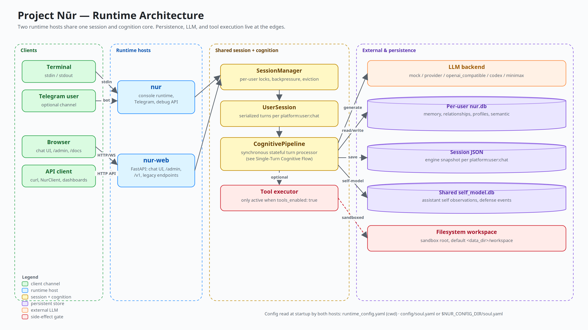

<p align="center">
  <picture>
    <source media="(prefers-color-scheme: dark)" srcset="docs/diagrams/wordmark-dark.svg">
    
  </picture>
</p>

<p align="center">
  <strong>An assistant that remembers what we meant to each other.</strong>
</p>

<p align="center">
  <a href="https://github.com/balfiky/nur/actions/workflows/ci.yml"></a>
  <a href="LICENSE"></a>
  <a href="pyproject.toml"></a>
  <a href="CHANGELOG.md"></a>
</p>

Most assistants reset to zero every turn. **Nūr keeps the room lit.**

Mood, trust, tension, repair, commitments, and the long arc of a relationship live as runtime state — inspectable, persistent, decaying, testable. The LLM still writes the words. Nūr changes the state those words come from.

[Quickstart](#quickstart) · [Overview](docs/OVERVIEW.md) · [Architecture](docs/ARCHITECTURE.md) · [Admin & Deploy](docs/DEPLOYMENT_AND_ADMIN.md) · [Privacy](PRIVACY.md) · [Changelog](CHANGELOG.md)

---

> **Honest scope.** Nūr is an experimental runtime, not a therapist. It claims no consciousness, no feelings, no clinical validity. Relational and semantic memory live under `data/` — use it with consent when other people are involved. See [PRIVACY.md](PRIVACY.md) for inspection, export, and deletion.

## What That Feels Like

```text
Day 1
You:  You completely misunderstood me.
Nūr:  You're right. I missed what mattered there.
                                  # rupture recorded · trust drops · open loop created

Day 3
You:  I think I was too harsh earlier.
Nūr:  I remember that moment. We don't have to ignore it.
      Want to repair it properly?
                                  # repair detected · loop begins to close

Day 10
You:  This feels easier now.
Nūr:  It does. There was tension here before, and it softened.
                                  # relationship arc persists across sessions
```

The LLM writes language. Deterministic state, memory retrieval, and safety gates live *outside* the model — so the assistant's stance toward you accumulates instead of resetting.

## Why This Is Different

Most assistant memory systems store facts:

- your name
- your preferences
- things you asked before

Nūr stores relational state:

- what felt warm
- what felt unresolved
- what broke trust
- what repaired it
- what commitments remain open
- how the assistant's stance should change after history

The LLM still writes the words. Nūr changes the state those words come from.

## Life History And Evolution

Nūr also has an early **Life History** layer for formative material: pasted
texts, notes, essays, browser-uploaded text/Markdown files, and explicit chat
requests like "learn from this project: <url>". This is not just a summarizer.
It records an experience, then writes an inspectable evolution trace: belief
shifts, drive changes, self-trait observations, and future behavior tendencies.

That means the project now has two distinct continuity layers:

- **Relational continuity:** how Nūr remembers people, tension, repair, and
  unfinished business.
- **Identity continuity:** how Nūr records experiences that may change its
  worldview, motivations, and self-model over time.

This layer is intentionally experimental. It is observable in `/settings` →
**Life History** and stored under `data/shared/life_history.db`. The settings
workspace includes an evolution snapshot: first/latest experience, strongest
drive drift, dominant drive pressure, and change-type mix. Runtime sessions load
a compact slice of current beliefs, shifted drives, and recent evolution into
generation, so formative experiences can bias Nūr's perspective without dumping
raw source material into every prompt.

When a user explicitly asks Nūr to learn from a URL, the runtime fetches
readable text, preserves the source reference, writes the Life History event,
and appends a short learning receipt. Ordinary search, browsing, and casual
conversation do not mutate identity-level Life History.

## Build With It

Use Nūr if you want to experiment with:

- emotionally persistent AI companions
- long-running personal assistants
- relationship-aware agent memory
- formative experience and worldview tracking
- imported Agent Skills as bounded runtime guidance
- inspectable affective state
- rupture, repair, and commitment tracking
- safer stateful tool use around LLMs

It is alpha, imperfect, and intentionally honest about what it does not prove.

## Quickstart

Nūr is not published on PyPI yet. Install from the GitHub repository:

```bash
python3 -m venv .venv
source .venv/bin/activate
python3 -m pip install --upgrade pip
python3 -m pip install "git+https://github.com/balfiky/nur.git"
nur-setup
```

`nur-setup` is terminal-native by default. It prompts for model backend,
identity, Telegram, and tool settings, then creates `runtime_config.yaml`,
local data/workspace folders, and marks setup complete. It does **not** launch a
browser.

Start the browser UI only when you ask for it:

```bash
nur-web --config runtime_config.yaml
```

If you prefer the browser wizard instead of terminal prompts, run it explicitly:

```bash
nur-setup --web --config runtime_config.yaml
```

For a LAN/public bind, run the same command with a public host:

```bash
nur-web --host 0.0.0.0 --port 8000 --config runtime_config.yaml
```

No API token is required by default. If you later set `api_key` in `/settings`,
the browser settings workspace has an **API Token** button for that hardened
mode.

To remove a local Nūr workspace:

```bash
nur-uninstall --dry-run
nur-uninstall
python3 -m pip uninstall project-nur
```

`nur-uninstall` removes the runtime config and local data directory after a
confirmation prompt. It keeps external tool workspaces and `$NUR_CONFIG_DIR`
identity files unless you explicitly pass the removal flags shown in
`nur-uninstall --help`.

To keep your customized agent identity across upgrades:

```bash
export NUR_CONFIG_DIR=~/.config/nur
mkdir -p "$NUR_CONFIG_DIR"
```

### From Source

```bash
git clone https://github.com/balfiky/nur.git
cd nur
python3 -m pip install -e ".[dev]"
nur-web                    # web UI at :8000
nur-setup                  # terminal setup
nur-setup --web            # browser setup wizard
nur-uninstall              # remove local config/data after confirmation
nur-validate --mode full   # local release-readiness validation
nur                        # console runtime
```

## Start Here

| Need | Document |
|---|---|
| Product/concept overview | [docs/OVERVIEW.md](docs/OVERVIEW.md) |
| Reviewer study guide | [docs/STUDY_GUIDE.md](docs/STUDY_GUIDE.md) |
| Runtime architecture | [docs/ARCHITECTURE.md](docs/ARCHITECTURE.md) |
| Install, admin, deployment | [docs/DEPLOYMENT_AND_ADMIN.md](docs/DEPLOYMENT_AND_ADMIN.md) |
| Security model | [SECURITY.md](SECURITY.md) |
| Privacy and data deletion | [PRIVACY.md](PRIVACY.md) |
| Release history | [CHANGELOG.md](CHANGELOG.md) |
| Contributing | [CONTRIBUTING.md](CONTRIBUTING.md) |

## Validation

Use `nur-validate` before publishing or tagging releases. In a source checkout
it runs repository checks; in an installed workspace it automatically switches
to installed-package checks.

```bash
nur-validate --mode quick    # static metadata/docs/config checks
nur-validate --mode full     # quick + pytest + wheel/package-data checks
nur-validate --mode release  # full + tag and install-smoke checks
```

CI runs `nur-validate --mode ci` plus the full pytest suite on Python 3.10,
3.11, and 3.12.

## Configure An LLM

The setup wizard or `/settings` workspace is the preferred path.

| Backend | Use case |
|---|---|
| `mock` | Offline/local testing with deterministic mock responses |
| `provider` | Hosted OpenAI-compatible gateways |
| `openai_compatible` | Local/remote servers (Ollama, LM Studio, vLLM) |
| `codex` | Local Codex CLI session using your existing Codex login |
| `auto` | Compatibility fallback; warns when no LLM is configured |

For `codex`, install/login to the Codex CLI first. Nūr runs `codex exec` in
read-only ephemeral mode; set `llm_model` to override Codex's default model, or
leave it blank.

Runtime config is `runtime_config.yaml` in the current working directory. Identity is `config/soul.yaml`, or `$NUR_CONFIG_DIR/soul.yaml` when the override is set.

## Architecture At A Glance



Two entry points share the same session and cognition layer:

- `nur-web` — FastAPI, bundled chat UI, `/settings`, admin API endpoints, `/v1/*`
- `nur` — console, Telegram, debug runtime

The core turn path runs `SessionManager` → `UserSession` → `CognitivePipeline`. The LLM writes language; deterministic state, memory, safety gates, and retrieval happen around it. See [docs/ARCHITECTURE.md](docs/ARCHITECTURE.md).

## API Quick Tour

```bash
# Health, no auth required
curl http://127.0.0.1:8000/v1/health

# Chat, auth optional unless api_key is configured
curl -X POST http://127.0.0.1:8000/v1/chat \
  -H 'Content-Type: application/json' \
  -d '{"message":"hello","user_id":"demo","chat_id":"main"}'

# With auth enabled
curl -X POST http://127.0.0.1:8000/v1/chat \
  -H 'Authorization: Bearer YOUR_TOKEN' \
  -H 'Content-Type: application/json' \
  -d '{"message":"hello","user_id":"demo","chat_id":"main"}'
```

OpenAPI docs at http://127.0.0.1:8000/docs when the server is running.

## Production Posture

Before exposing Nūr beyond localhost:

- Set `api_key` so admin and chat endpoints require bearer auth
- Keep `tools_enabled: false` and `shell_tool_enabled: false` unless explicitly needed
- Use first-class read-only tools for routine host facts; shell is a separate local-command surface
- Set Telegram allowlists before enabling a bot
- Treat `data/`, `runtime_config.yaml`, and backups as sensitive
- Read [docs/DEPLOYMENT_AND_ADMIN.md](docs/DEPLOYMENT_AND_ADMIN.md), [SECURITY.md](SECURITY.md), and [PRIVACY.md](PRIVACY.md)

## Common Commands

```bash
python3 -m pytest                                # full suite
python3 -m pytest tests/test_interface.py -q     # focused interface tests
nur-uat --artifacts reports/uat/mock             # browser/admin UAT with mock backend
python3 -m evals --backend mock --tag phase11    # offline behavioral eval pack
python3 -m build --sdist --wheel                 # build wheel and sdist
```

For clean setup and live backend acceptance checks, see
[docs/UAT.md](docs/UAT.md).

## Repository Layout

```text
config/     YAML config and prompt templates
core/       Cognitive state, appraisal, memory, profiles, dual process
runtime/    Runtime config, channels, session lifecycle, tool factory
interface/  FastAPI app, /v1 API, client, bundled web UI
evals/      Behavioral scenario and ablation harness
tests/      Unit, integration, regression, runtime, and API tests
docs/       Public docs, design docs, diagrams, research notes
```

## Current Status

Version `0.28.6`. Reproducible eval evidence is intentionally narrow: relationship memory remains load-bearing under Phase 11, Life History now has bounded structural influence through LifeInfluence under Phase 13, and semantic memory has a dedicated structural scenario suite. The web and Telegram surfaces expose this state through presentation-only introspection. These are structural/inspectable results, not proof of human-likeness, therapeutic value, consciousness, or psychological validity.
