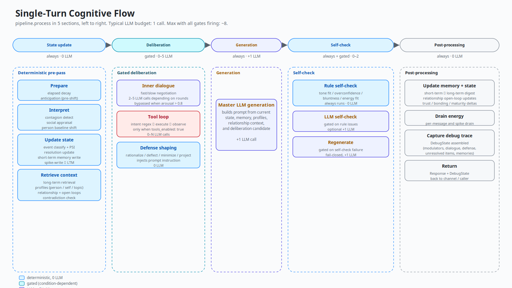
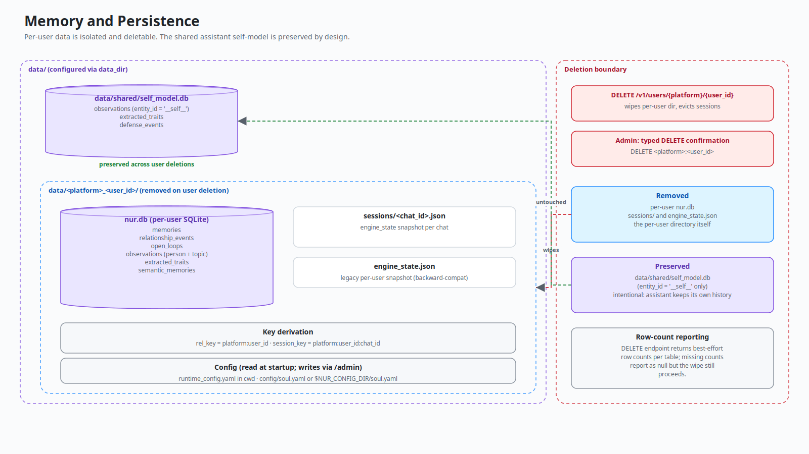
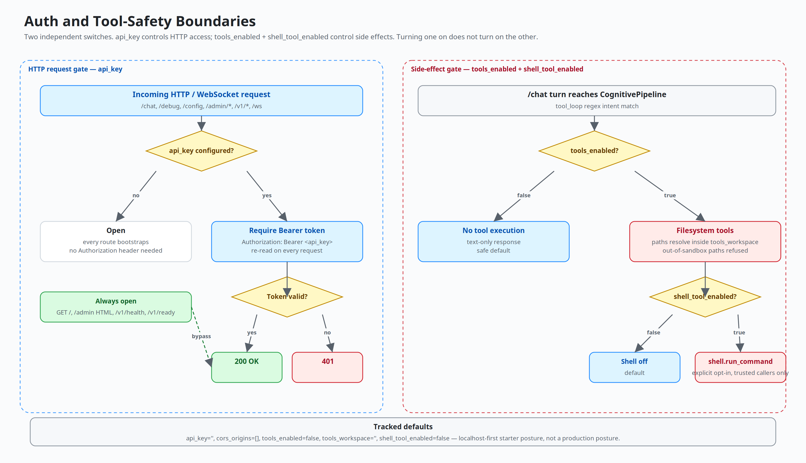
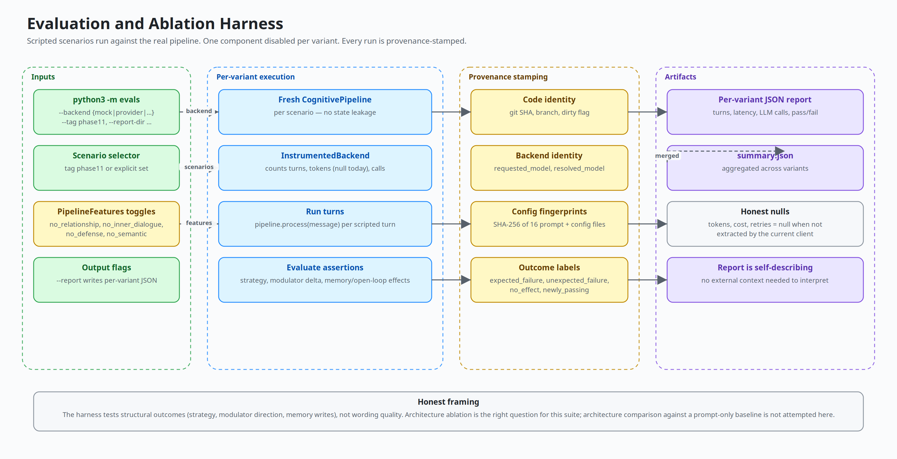
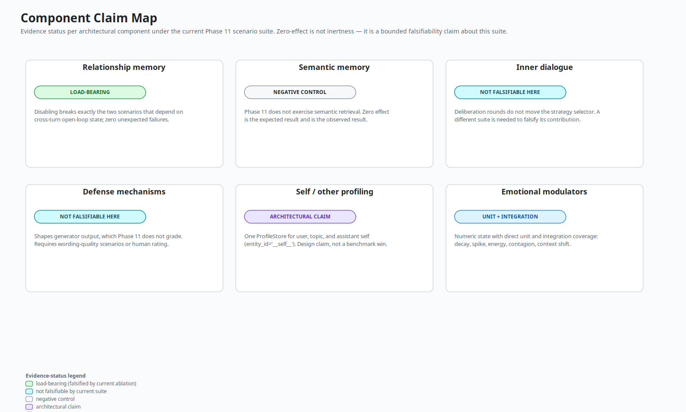

# Project Nūr — Architecture Reference

Structural reference for Nūr's runtime, cognition, persistence, and
operator surfaces. Narrative about motivation, evidence, and honest
framing lives in [OVERVIEW.md](OVERVIEW.md); this doc is a reference for
code-level orientation.

## Scope

Nūr is a hybrid cognitive runtime. The LLM generates language; the
assistant's stance is shaped by explicit state outside the model:

- persistent emotional modulators
- short-term and long-term memory
- relationship-arc memory
- semantic memory
- identity-level life history and evolution records
- self/other/topic profiles
- bounded deliberation and self-check gates
- runtime/session safety boundaries

Inspired by PSI, ACT-R, and CLARION; not a faithful implementation of
any of them.

## Runtime Topology

Two executable hosts converge on one session and cognition layer:

| Entry point | Purpose |
|---|---|
| `nur-web` | FastAPI: chat UI, `/admin`, legacy routes, `/v1/*`, OpenAPI |
| `nur` | Console runtime, Telegram channel, debug runtime |

A turn flows: channel receives input → `SessionManager` resolves or
creates the active session → `UserSession` serializes turns per user and
bridges async code to the synchronous pipeline → `CognitivePipeline.process()`
updates state, retrieves memory, runs gates, and calls the LLM backend
when needed → persistence writes state back.

## Single-Turn Cognitive Flow

Typical per-turn LLM budget is **1** call. Maximum with every gate
firing is roughly **8** (2–5 for inner dialogue, +1 master generation,
+1 LLM self-check, +1 regenerate). Inner-dialogue parsing may retry, so
there is no fixed upper bound in pathological cases.

Code entry point: `pipeline.py::CognitivePipeline.process`.

## Emotional State

Six modulators, each a continuous value in [0, 1]:

| Modulator | Meaning |
|---|---|
| `arousal` | activation / charge |
| `valence` | positive / negative mood |
| `certainty` | confidence in interpretation |
| `bonding` | relational closeness |
| `energy` | processing fatigue / recovery |
| `resolution` | unresolved tension / load |

These are numeric state variables that decay over time, shift from
events, and influence later turns. Decay half-lives, event impacts, and
contagion caps live in `config/modulators.yaml`.

## Memory And Persistence

Persistence is deliberately split:

| Path | Purpose |
|---|---|
| `data/<platform>_<user_id>/nur.db` | per-user long-term emotional, semantic, relationship, and profile data |
| `data/<platform>_<user_id>/sessions/<chat_id>.json` | per-chat session engine state |
| `data/<platform>_<user_id>/sessions/<chat_id>.history.json` | active hot transcript restored until session end, `/reset`, or `/new` |
| `data/shared/self_model.db` | assistant self-model shared across users |
| `data/shared/life_history.db` | shared experience/evolution ledger for formative material |
| `runtime_config.yaml` | operator runtime configuration (current working directory) |
| `$NUR_CONFIG_DIR/soul.yaml` | optional user-owned identity override for wheel installs |

User deletion removes per-user data and evicts active sessions. It
intentionally does not erase shared assistant identity stores
(`self_model.db`, `life_history.db`). See [PRIVACY.md](../PRIVACY.md)
for the deletion contract.

## Life History And Evolution

The Life History subsystem is an identity-level ledger, not per-user chat
memory. Code entry point: `runtime/life_history.py`.

Supported v1 inputs:

| Input | Path |
|---|---|
| Pasted text | `POST /admin/life/experiences/text` |
| Browser-uploaded text/Markdown file | `POST /admin/life/experiences/upload` |
| Advanced local text/Markdown file | `POST /admin/life/experiences/file` |
| Explicit conversation learning URL/text | `runtime.learning_intake` via `SessionManager` |

Browser uploads are the normal product path. Local file intake is restricted to
`RuntimeConfig.resolved_tools_workspace` for operators who deliberately want
server-side paths. Conversation learning only runs on explicit language such as
"learn from this URL", "study this project", or "digest: <material>"; ordinary
search/browsing requests do not mutate identity-level Life History. The
canonical store is SQLite at
`data/shared/life_history.db`; graph and vector stores are intentionally
deferred projections, not the source of truth.

Core records:

| Record | Purpose |
|---|---|
| `experience_events` | what Nūr encountered: title, source, participants, summary, salience, emotional impact |
| `evolution_events` | what changed afterward: belief, drive, self-trait, worldview/future behavior |
| `beliefs` / `belief_revisions` | current worldview statements plus before/after revision history |
| `drive_states` / `drive_changes` | persistent motivation values and their change log |

The admin console exposes this as `/admin` → **Life**: summary counts,
an evolution snapshot, experience ledger, evolution timeline, beliefs, and
drives. The snapshot is deterministic and operator-facing: first/latest
experience, strongest drive drift, dominant drive pressure, and change-type
mix. This is the observability surface for character drift. Runtime sessions
also load a compact prompt slice from this store — current beliefs, shifted
drives, and recent evolution events — so normal chat can be shaped by
identity-level experience without sending raw source material every turn.

Life History also has a deterministic behavior-shaping path through
`core.life_influence.LifeInfluence`. The pipeline derives bounded pressure
values from the compact Life History context and records explicit debug
effects when those pressures affect strategy tie-breaks, proactive scoring,
action variables, or semantic-memory salience. When
`PipelineFeatures.life_history_context` is disabled, the context is empty,
the influence is neutral, no Life History text enters generation, and no
LifeInfluence effects are recorded.

## Debug Presentation Surfaces

`runtime.debug.relationship_view` builds a stable, presentation-only JSON
summary from `DebugState`: current strategy, strategy trace reason, six
modulator values and known deltas, trust, relationship loops/events,
LifeInfluence pressures/effects, and memory-use counts. It does not query
stores, call an LLM, mutate state, or make cognitive decisions.

`runtime.debug.persona_view` sits above that relationship view as the unified
user-facing observability shape. It translates the six modulators into
plain-language emotion labels, adds perception/appraisal, relationship,
Life History, memory, skills, tools, and deterministic explanation summaries,
and keeps the same presentation-only boundary.

The bundled web debug panel consumes the serialized debug payload to show
persona state, relationship state, deterministic "Why this response?"
explanations, state deltas when a previous turn is available, and a compact
"What Nūr remembers" view. These surfaces are observability/UI only; the
pipeline remains the owner of appraisal, memory retrieval, strategy selection,
and LifeInfluence.

The standalone `/persona` dashboard, also available as `/dashboard`, uses the
same `persona_view` shape through `/admin/persona/state`, but it reads the
shared runtime session manager instead of any one chat channel. It lists active
Web, Telegram, console, or future channel sessions and renders the selected
session's emotion, perception, relationship, Life, memory, skills, tools, and
explanation state. The endpoint does not create sessions, call the pipeline, or
mutate cognition.

Telegram exposes the same boundary through non-mutating introspection commands:
`/state`, `/why`, `/memory`, `/loops`, `/repair`, and `/persona`. They inspect
the active session's last debug state only; they do not create sessions, call
the pipeline, write memory, or change emotional state.

## LLM Boundary

Provider-neutral interface with five backend modes: `mock`, `provider`,
`openai_compatible`, `minimax`, `auto`. The LLM receives a rendered
prompt containing current cognitive context. It does not own
persistence, tool policy, auth policy, or session lifecycle. Important
state stays inspectable outside prompt text.

## Auth And Tool Safety

Two independent switches:

| Setting | Controls |
|---|---|
| `api_key` | HTTP bearer auth for admin/chat surfaces when configured |
| `tools_enabled` | whether chat turns can invoke tool side effects |
| `tools_workspace` | filesystem sandbox root for file tools |
| `shell_tool_enabled` | second explicit opt-in for shell execution |

Turning on tools does not turn on auth, and setting auth does not turn
on tools. Production deployments should set `api_key` before exposing
the server and leave tools disabled unless needed.

Built-in read-only tools cover hostname, OS/kernel facts, disk usage,
installed package inventory, filesystem reads inside the configured workspace,
web search/fetch, browser state, and calendar reads. Web search is a
best-effort DuckDuckGo HTML provider that returns titles, resolved URLs, and
snippets when available; fetched/readable page text is passed into the
generator as bounded tool context. The shell tool is a separate high-risk
opt-in and runs through the local shell, so pipes and other normal shell syntax
work when the operator deliberately enables it.

## Skills

Imported Agent Skills live under `data/skills` with a JSON registry. Code
entry point: `runtime/skills.py`.

The admin console imports uploaded `SKILL.md`/Markdown files, zipped skill
folders, server-side skill folders, or pasted `SKILL.md`, audits them for
metadata, tool hints, scripts, risk flags, and unsupported platform features,
then keeps them disabled until an operator enables them. Once enabled, the skill
enters generation as bounded private guidance: name, description, instructions,
tool hints, and risk flags. Scripts and resources are not executed by the
skills module. Any real action still has to pass through
normal tool policy, auth, workspace, and shell gates.

## Admin And Setup Surface

The web UI includes a first-run setup wizard, a quick settings drawer,
and a full-screen `/admin` operator console linked from the chat header.
All three surfaces use the same `RuntimeConfig` and runtime factories as
the rest of the app. Operational instructions live in
[DEPLOYMENT_AND_ADMIN.md](DEPLOYMENT_AND_ADMIN.md).

## Evaluation And Ablation Harness

The harness runs scripted behavioral scenarios against a real pipeline
with one component disabled at a time and records provenance on every
run. Evidence discussion is in [OVERVIEW.md §4–6](OVERVIEW.md#4-evaluation).

Entry point: `python3 -m evals`. Pre-registered hypothesis table lives
in `evals/ablation_hypotheses.py`.

Current structural evidence artifacts include:

| Artifact | Scenario tag | Structural claim |
|---|---|---|
| `reports/ablation/summary.json` | `phase11` | relationship memory remains load-bearing for the original cross-turn suite |
| `reports/ablation/relationship_phase12_summary.json` | `phase12_relationship` | expanded open-loop, repair, recurrence, commitment, and old-rupture retrieval coverage |
| `reports/ablation/life_history_summary.json` | `phase13_life` | Life History context and `LifeInfluence` produce bounded, inspectable policy effects |
| `reports/ablation/semantic_memory_summary.json` | `semantic_memory` | semantic preferences, decisions, isolation, ranking, and disabled-memory failures are covered structurally |

These artifacts validate deterministic internal behavior. They do not
constitute a blinded human-likeness or user-experience study.
Focused longitudinal regression tests additionally cover warm-start rupture
and repair, recurring tension, explicit commitment resolution, LifeInfluence
relationship tie-breaks, and preference plus relationship-loop retrieval.

## Component Claim Map

The diagram is authoritative. See
[OVERVIEW.md §5](OVERVIEW.md#5-what-the-evidence-supports) for prose.

## Maintenance Matrix

Keep this doc current. When you change architecture-sensitive code,
update the marked pieces in the same PR:

| Code change | Update |
|---|---|
| Pipeline stage order | single-turn flow diagram (`tools/build_diagrams.py::build_single_turn_flow`), this doc's Single-Turn section |
| Storage/table changes | memory model diagram, this doc's Memory section, [PRIVACY.md](../PRIVACY.md) |
| HTTP route / auth changes | auth-tool diagram, this doc's Auth section, [SECURITY.md](../SECURITY.md) |
| New admin behavior | [DEPLOYMENT_AND_ADMIN.md](DEPLOYMENT_AND_ADMIN.md) |
| New eval variant | evaluation diagram, this doc's Evaluation section, `evals/ablation_hypotheses.py` before running |
| Component evidence status change | component claim map diagram, [OVERVIEW.md §5](OVERVIEW.md#5-what-the-evidence-supports) |

Diagrams regenerate with `python3 tools/render_diagram_pngs.py` after
editing `tools/build_diagrams.py`.
